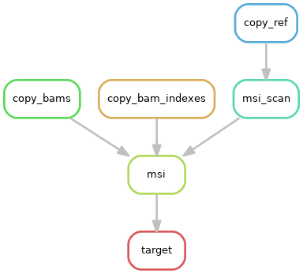

# Snakemake workflow: bam-msisensor

This is a [Snakemake](https://academic.oup.com/bioinformatics/article/28/19/2520/290322) workflow for microsatellite instability detection in bam files, powered by [MSISensor](https://github.com/ding-lab/msisensor).

Each tool belong to their authors.

See [wiki] for more information.

# Rule Graph

